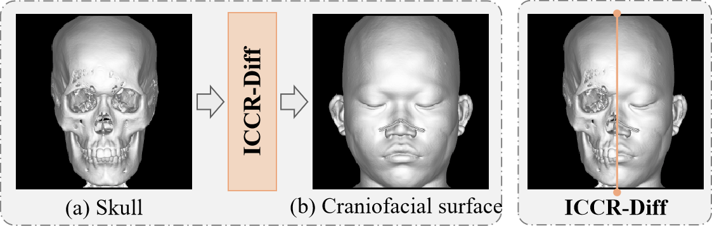

# ICCR-Diff: Identity-Preserving and Controllable Craniofacial Reconstruction with Diffusion Models

Official implementation of [ICCR-Diff: Identity-Preserving and Controllable Craniofacial Reconstruction with Diffusion Models](https://arxiv.org/abs/2302.05543).

<p align="center">
  
</p>

## 📖 Abstract

Craniofacial reconstruction predicts craniofacial features from skull morphology to reconstruct the craniofacial surface. Although previous methods have achieved promising performance, they face three critical limitations: insufficient image quality, poor identity preservation, and difficulties with conditional control. To overcome these challenges, we propose a novel diffusion-based craniofacial reconstruction method that preserves identity across domain transfer. Our approach incorporates multiple modules to separately manage multimodal information including skull data, landmarks, texture features, and biometric information, yielding high-fidelity results under various constraints. Furthermore, by enabling flexible modification of biometric information through standardized text prompts, our method achieves fine-grained control while maintaining individual identity characteristics. Extensive experimental results demonstrate that our method outperforms existing approaches in image quality and identity retrieval, showcasing exceptional robustness, strong identity preservation, and enhanced editability.

<!--  -->
<p align="center">
  
</p>


## 🚀 Highlights

*   **1.Image Quality:** A *diffusion-based* craniofacial reconstruction method for generating high-fidelity results.
*   **2.Identity Preservation:** Integration of *multimodal information* to ensure strong identity preservation..
*   **3.Conditional Control,:** Modification of biometric *text* for highly flexible and fine-grained controllable results.


## 🛠️ Getting Started

### 1. Environment Setup

```bash
# Clone the repository
git clone https://github.com/mqzhang2024/ICCR.git
cd ICCR

# Create conda environment
conda env create -f environment.yaml
conda activate control
```

### 2. Pretrained Checkpoints

-  Stable Diffuison1.5:
Download the pretrained stable diffusion models "v1-5-pruned-emaonly.ckpt" from [huggingface](https://huggingface.co/stable-diffusion-v1-5/stable-diffusion-v1-5/tree/main) to "./models". Then execute the following command:

```bash
python tool_add_control.py ./models/v1-5-pruned-emaonly.ckpt ./models/control_sd15_ini.ckpt
```

- PiPNet:
Train the PipNet network to capture contour feature points of key craniofacial structures. The training code uses [PiPNet](https://github.com/jhb86253817/PIPNet). Upon completion of the training, save the `meanface file` and the `weight file` to `./muti_control/pip_pretrained/`.


<p align="center">
  
</p>


### 3. Prepare Datasets

Image data should be stored in the "data" folder within the root directory.
```bash
- data
  - pairedCS
    - Craniofacial    # Craniofacial image
    - skull           # skull image
```

Subsequently, manually partition the training and validation. Then generate JSON files. Demo files can be found in `./data/split_data`.
```bash
- data
  - split_data
    - train.json    # train datasets
    - valid.json    # valid datasets
```


### 4. Start Training

```bash
python train.py 
```
Note: You can modify the `config` information in `train.py`.


### 5. Sampling

```bash
python train.py 
```
Note: You can modify the `config` information in `sample.py`.


## 🙏 Acknowledgements

Our implementation is based on and inspired by:
- [ContorlNet](https://arxiv.org/abs/2302.05543): https://github.com/lllyasviel/ControlNet.
- [PiPNet](https://arxiv.org/abs/2003.03771): https://github.com/jhb86253817/PIPNet.
- [SPGD](https://arxiv.org/abs/2507.06656) :https://github.com/74587887/SPGD.

We gratefully acknowledge their contributions to the field.


## 📄 Citation

If you find our work useful, please kindly consider citing:

```bibtex
@article{wu2025enhancing,
  title={Enhancing Diffusion Model Stability for Image Restoration via Gradient Management},
  author={Wu, Hongjie and Zhang, Mingqin and He, Linchao and Zhou, Ji-Zhe and Lv, Jiancheng},
  journal={arXiv preprint arXiv:2507.06656},
  year={2025}
}
```